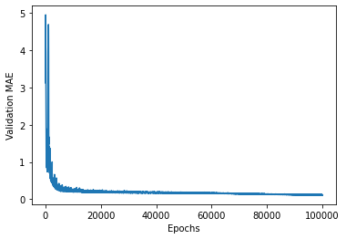

**Attention:** Feedforward Networks arent the best Neural Network structure to approach this type of problem. The ideal would be at least use a Recurrent Neural Network (RNN) or more efficient estructures like Long Short-Term Memory (LSTM) or Gated Recurrent Unit (GRU). **Check my repositories for new implementations**.

# Time Forecasting the COVID-19 Confirmed Cases With Deep (Not so deep) Feedforward Neural Networks

These scripts try to forecast the number of confirmed cases of COVID-19 on **Minas Gerais, a Brazil's state**. With Feedforward Neural Networks we can try to vaguely estimate the cases in some days at the future, but they arent the best network structure for this type of problem.

## Training the Deep (not so deep) FeedForward Neural Network:

The first step is to cread a Dataset. The data was gatered from the "Coronavirus - Brazil"* dataset on Kaggle on the day 22/03/2020. After this we extract the information about the days reports and the confirmed cases at that report for the Minas Gerais state, with this, we make some tensors to use like samples and targets for the training.

We can make simple scripts using the API Keras. The structure use was as follows:


```python
def build_model():

    #Define the structure of the nework
    model = models.Sequential()
    model.add(layers.Dense(160, activation='relu', input_dim=1))
    model.add(layers.Dense(100, activation='relu', init='uniform'))
    model.add(layers.Dense(80, activation='relu', init='uniform'))
    model.add(layers.Dense(output_dim=1))

    #Define the optimer and the learning rate:
    sgd = optimizers.SGD(lr=0.001);

    #Define the loss funcion and the optimizer algorithm
    model.compile(loss='mse',
                  optimizer=sgd,
                  metrics=['mae']
                  )

    return model
```

Training for 100000 epochs we reach these results:

Training logs:
<p align="center">

</p>

Fitting the data with our Black-Box model:
<p align="center">

</p>

Script logs:
Test MSE: 0.09059482492625202 (Medium Squared Error);
Test MAE 0.12379367269721686 (Medium Arithmetic Error);
Time: 527.2131970649998 (in seconds, on Google Collaboratory).

## Using the trained network to forecast the next days:

Logs:
Day of the year:  82.0   Forecasting of confirmed cases:  [74.30464] (22/03/2020) 
Day of the year:  83.0   Forecasting of confirmed cases:  [94.14468] 
Day of the year:  84.0   Forecasting of confirmed cases:  [114.03029] 
Day of the year:  85.0   Forecasting of confirmed cases:  [133.91684] 
Day of the year:  86.0   Forecasting of confirmed cases:  [153.80338] 
Day of the year:  87.0   Forecasting of confirmed cases:  [173.70389] 
Day of the year:  88.0   Forecasting of confirmed cases:  [193.60515] 
Day of the year:  89.0   Forecasting of confirmed cases:  [213.50491] 
Day of the year:  90.0   Forecasting of confirmed cases:  [233.40076] 
Day of the year:  91.0   Forecasting of confirmed cases:  [253.28593] 
Day of the year:  92.0   Forecasting of confirmed cases:  [273.16483] 

Graph:
<p align="center">

</p>

##Conclusions:

Again, Feedforward Neural Networks arent good at this type of problem (time-forecasting), so, dont take this result too seriously. But with more data we could achiev more realistic results, especially at short variations of time.

The ideal would be to use RNN, LSTM or GNU networks. Luckily, with Keras we can just change the neural network structure and make some changes to use these types of methods. **Check my repositories for new implementations**. 

At this time, with our dataset, we cant predict the number of deaths on the next days since there are no actual confirmed cases, so, the Deep Neural Network cant forecast since there are no information about the evolution of the system in time.

REFERENCES:
* **"Coronavirus - Brazil" Dataset on Kaggle:** https://www.kaggle.com/unanimad/corona-virus-brazil/version/22 (Viewed on: 22/03/2020)

